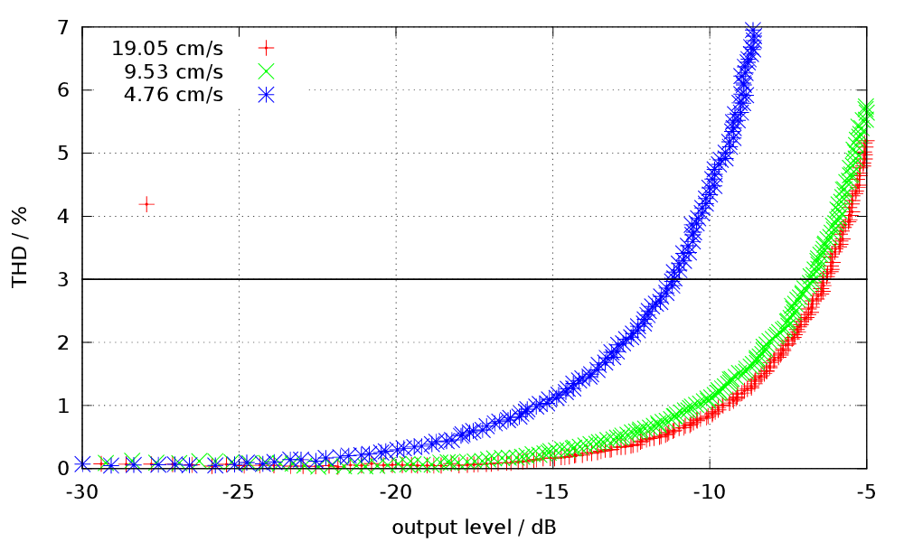
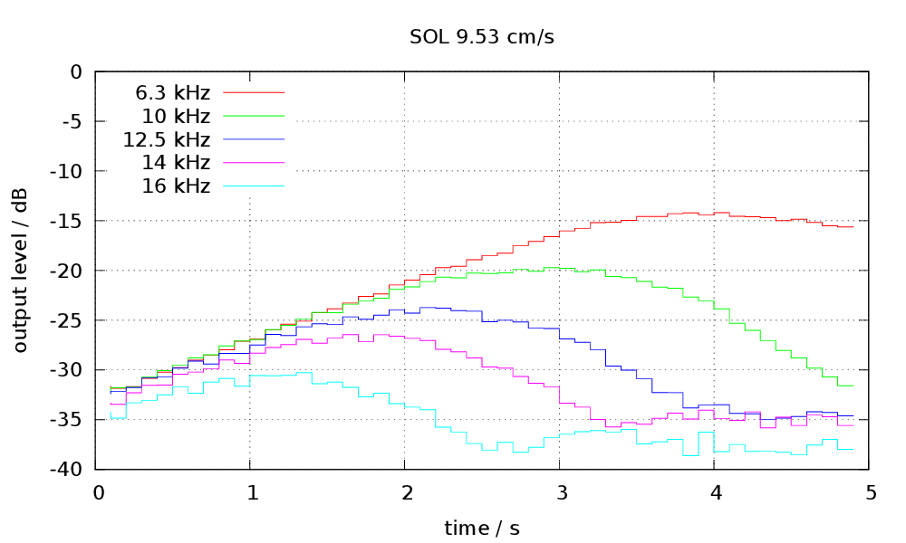

Tapetool
========

A collection of tools for measuring the recording performance of magnetic audio tape with your sound card:

1. generate a test signal in a wave-file with `testsignal.py`
2. record it onto the tape under test and digitise the played back signal using your favourite audio editor
3. analyse properties like MOL, SOL and THD using the tools from this package

Installation
------------

Unfortunately, there is no install or `setup.py` yet. Currently, you have to clone the source code into a local folder and run it directly there. The requirements for running it are:

* Python (tested with Python 2.7.2 on Ubuntu 12.04, Python 2.7.12 and Python 3.5.2 on Ubuntu 16.04)
* NumPy
* SciPy, in particular `scipy.io` and `scipy.signal`
* [Gnuplot](http://gnuplot.info/) if you want to use the plotting examples

Instructions for installing can be found here: [Installing the SciPy Stack](http://www.scipy.org/install.html)

Usage
-----

At this time, nothing in this package is user friendly - I'm sorry for that and will improve here if work continues and if someone is interested. Even adding a GUI or a windows installer would not be impossible.

First, you need to create a test signal by runnning `python testsignal.py`. There are two optional command line parameters: `--rate` to set a different sampling rate than the default of 96 kHz and `--slow` to switch the reference frequency from 1 kHz to 315 Hz. If you run it without these parameters, it will create a wave files, mono, 96kHz, for fast tape speeds (19.05 cm/s and above) called `testsignal.wav`

You can then use any audio editor, player and/or recorder that works on your system to record them to the tape under test and record the result back into your computer. I usually use Audacity, but I'd recommend to use the one you're most familiar with.

Be aware:
* Please take extra care to trim the beginning of the recorded file so that it aligns with the source signal. Some programs (e.g Audacity) try to compensate the delay caused by the tape loop as a latency, but fail in finding the right alignment. The analysis routines rely on the position of the test tones in the file.
* Also the function for reading wave files is limited and can't read 24 bit files. Please use either 16 bit or 32 bit wave.
* It also doesn't like extra chunks in the wave file with metadata (such as track or artist names) - please don't add them.

The first signal in the file, a steady tone at -10dB (amplitude) and reference frequency, corresponds to the magnetic reference level for the tape under test. Therefore you should set the recording level for that tone such that on playback, the same level as the referece level from a tape with known reference level is reached. It's helpful if your audio tool has a loop play function for this.

To be sure against distortion from record or playback amplifiers, try a dry run including the tape deck in _source_ mode to get a feeling up to what levels you can trust the electronics of the tape deck. Also try connecting input and output of your sound card directly to see what it adds to distortion and saturation.

Running all measurements can be done by using `all.py`. You can run it on the generated test tones as a demonstration:

```
$ python all.py testsignal.wav fast
prefix is "fast"
using 1 kHz as reference frequency
using wave file "testsignal.wav" as input
sample rate is 96000 Hz, read 3840000 samples (40.0 seconds)
reference level: -13.0102999647
THD at reference level: 0.0259502561826
MOL 3%      :  -3.14dB
SOL 6.3 kHz :  -3.91dB at 4.9s
SOL 10 kHz  :  -3.91dB at 4.9s
SOL 12.5 kHz:  -3.91dB at 4.9s
SOL 14 kHz  :  -3.91dB at 4.9s
SOL 16 kHz  :  -3.91dB at 4.9s
```

The script has two mandatory command line parameters: The wave file to analyse and a prefix that's used as a measurement name and result file prefix. Parameters are explained with the `-h` option.

As we're running on the unchanged test signal, there is no relevant distortion or saturation to be measured. Please also note that `testsignal.py` uses amplitudes (e.g. -10dB as reference level), while this output uses RMS values (e.g. -13.01dB for the reference level).

The results of the MOL and SOL measurements have been stored in text files `fast-mol.dat` and `fast-sol.dat`. They can be used e.g. for generating plots, like these examples from a run on real tape:





Further Reading
---------------

I've discussed the ideas for this package in a german reel-to-reel forum: [Band-Kenndaten messen](http://forum2.magnetofon.de/board2-tonbandger%C3%A4te/board20-tipps-und-erkenntnisse/17846-band-kenndaten-messen/). Unfortunately, it's in german, and is not meant as an excuse for not providing proper documentation so far.

An example of a real-world datasheet can be found here: [RMGI LPR35 Datasheet](http://www.rmgi.eu/pdf/RMGI_LPR_35.pdf)

The primary source for the definition of the measurements I'm trying do to is the _IEC 94 Part 5_. Unfortunately, I've not found a freely accessible source in the internet. My reference is a booklet with the german tranlsation (_Beuth-Verlag, Magnettontechnik, ISBN 3-410-12617-1_).

Feedback
--------

Any comments, criticism or other feedback is highly welcome. Don't hesitate to contact me with any questions. You can reach me by e-mail: andreas.schmidt.42@gmx.net

Licensing
---------

The code in this project is licensed under the MIT license.

